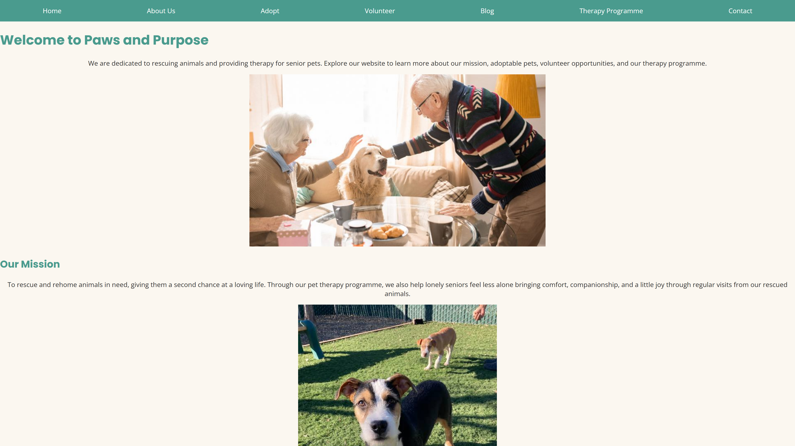
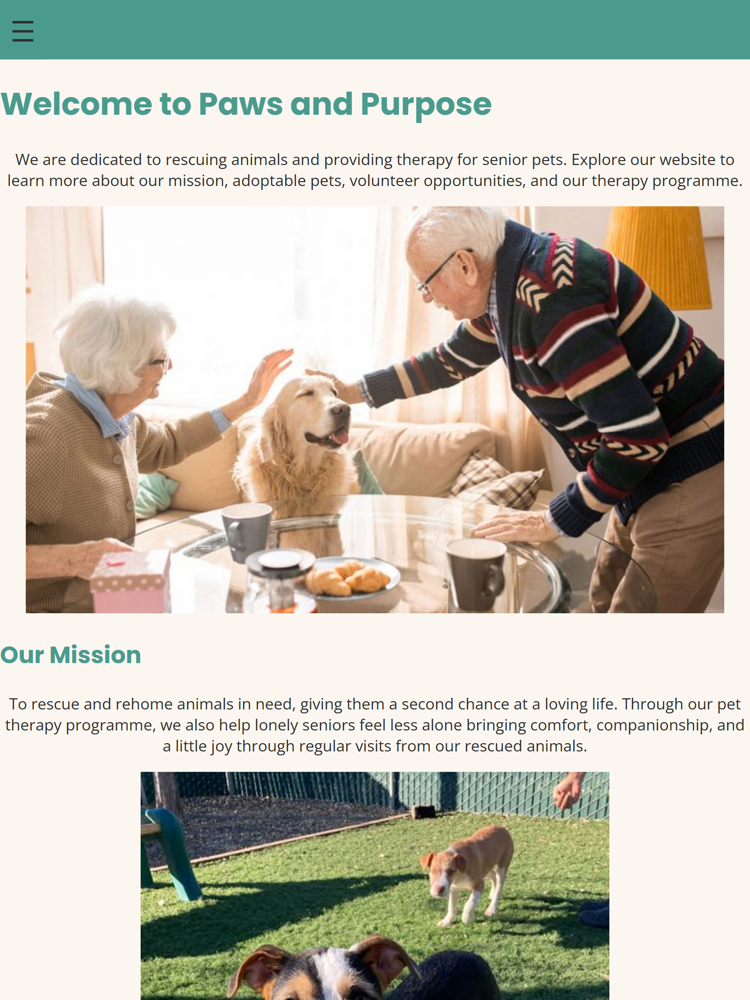
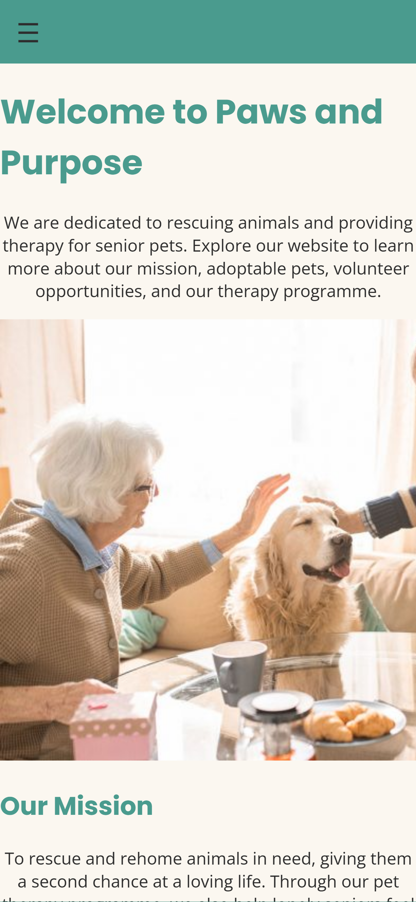

# Paws & Purpose Website
 
Paws & Purpose is a fictional non-profit animal rescue and senior pet therapy organisation based in Cape Town. This repository contains the website project, covering Part 1 through to development.
 
Student Information
 
ST10507283
Ethan Van Wyk
 
## Pages
 
- **index.html** — Home
- **about.html** — About Us
- **adopt.html** — Adoptable Pets
- **get-involved.html** — Get Involved (volunteering, fostering, donating)
- **blog.html** — Blog / News
- **therapy-programme.html** — Pet Therapy Programme
- **contact.html** — Contact & enquiry form
## Technologies Used
 
- HTML5
- CSS3 (external stylesheet, Flexbox, CSS Grid, media queries)
- JavaScript *(to be added)*
## Folder Structure
 
```
Paws-and-Purpose-Website/
├── index.html, about.html, adopt.html, get-involved.html,
│   blog.html, therapy-programme.html, contact.html
├── style.css
├── images/        — pet photos, hero
├── content/       — draft page copy (text source before HTML build)
├── fonts/         — Poppins and Open Sans font files
└── docs/          — sitemap, proposal, wireframes
```
 
## Changelog
 
**Part 2 — CSS Styling and Responsive Design**
- Addressed lecturer feedback from Part 1: built a responsive photo grid for the Adopt page using CSS Grid, and consolidated separate forms into one multi-purpose enquiry form (Adoption and Volunteering) on the Contact page.
- Removed the duplicate facility visit-request form from the Therapy Programme page; replaced it with a link to the Contact page.
- Created an external stylesheet (`style.css`) and linked it across all site pages.
- Added base typography (Poppins for headings, Open Sans for body text, imported via Google Fonts) and site-wide colour scheme (Teal, Coral, Cream, Charcoal).
- Styled the navigation bar and footer using Flexbox, including hover states and even column spacing.
- Built a reusable `.button` class for call-to-action links, with a hover state.
- Fixed content inconsistencies: corrected the Therapy Programme page's description to specifically reference aged-care facilities and housebound seniors (previously mentioned hospitals and schools, which didn't match the approved proposal).
- Standardised page titles across all pages to a consistent "Page Name | Paws and Purpose" format.

 
Evidence of the site displayed across different screen sizes.
 
**Desktop**
 

 
**Tablet**
 

 
**Mobile**
 

 
## References
 
Nielsen Norman Group, "Website usability guidelines," 2024. [Online]. Available: https://www.nngroup.com/. [Accessed: 14-Aug-2026].
 
World Wide Web Consortium (W3C), "Web content accessibility guidelines (WCAG) 2.1," 2023. [Online]. Available: https://www.w3.org/WAI/standards-guidelines/wcag/. [Accessed: 14-Aug-2026].
 
Google, "web.dev — best practices for responsive web design," 2024. [Online]. Available: https://web.dev/. [Accessed: 14-Aug-2026].
 
Afrihost, "Domain and hosting pricing," 2025. [Online]. Available: https://www.afrihost.com/. [Accessed: 14-Aug-2026].
 
Google Fonts, "Poppins & Open Sans font families," 2025. [Online]. Available: https://fonts.google.com/. [Accessed: 14-Aug-2026].
 
Unsplash, "Free stock photography," 2026. [Online]. Available: https://unsplash.com/. [Accessed: 14-Aug-2026].
 
Pexels, "Free stock photos & videos," 2026. [Online]. Available: https://www.pexels.com/. [Accessed: 14-Aug-2026].
 
Flaticon, "Free vector icons," 2026. [Online]. Available: https://www.flaticon.com/. [Accessed: 14-Aug-2026].
 
All page copy, pet bios, blog posts, and organisational content are original, written for this fictional project.
 